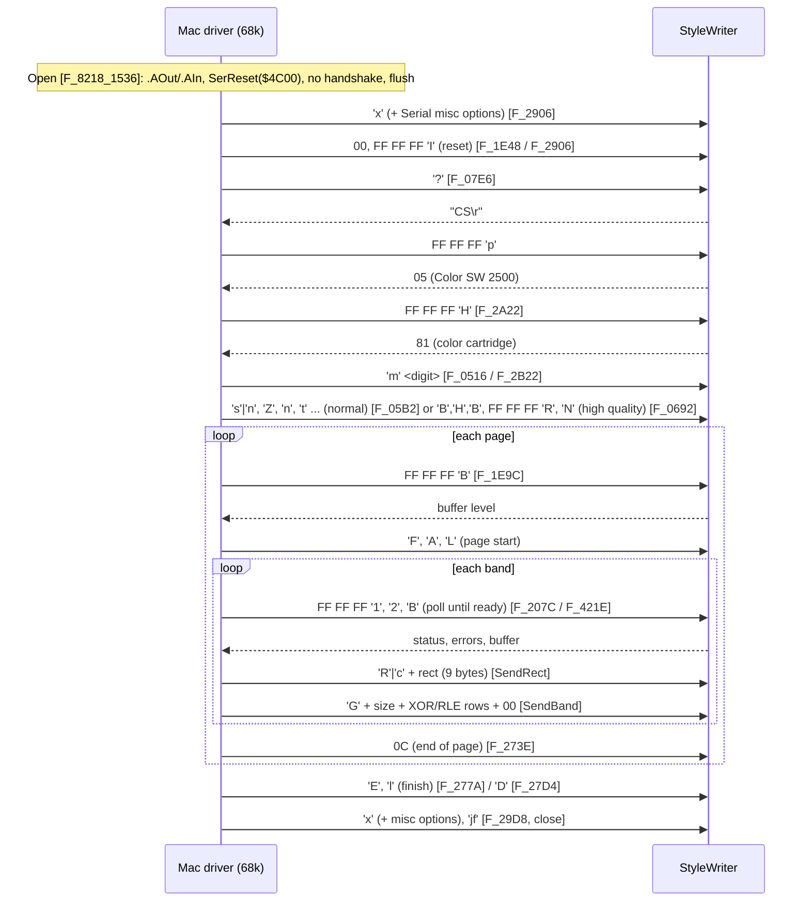

# Apple Color StyleWriter 2500 Driver — Disassembly Map

A reverse-engineering map of Apple's **Color SW 2500** printer driver for classic
Mac OS: how it is built, how it talks to the printer, and exactly what it sends.
The goal is to make `src/parser_stylewriter.c` a faithful stand-in for the
printer, and to understand why printing from the MiSTer Quadra 800 core failed
(see [stylewriter.md](stylewriter.md)).

- **Driver:** `System Folder 8.1:Extensions:Color SW 2500` (type `PRER`,
  creator `auro`) from the `QuadSquad8.hda` Quadra image. Its resource fork is
  412,430 bytes of 68k code and data; its data fork is 415,780 bytes of PowerPC
  code (PEF), not used on a 68k Mac.
- **Also analyzed:** the Mac OS 8.1 System file's serial-driver patch
  `PTCH 1660`, and the Quadra 800 ROM (`boot.rom`).
- **Tools:** `tools/macdriver/` (see [Reproducing this](#reproducing-this)).
  Disassembly is by capstone (68020), with the A5 jump table, OS glue and
  virtual calls resolved by hand.

Offsets below are **resource offsets** (they include the 4-byte CODE header).
Functions are named `F_<segment>_<offset>` (the segment is the absolute CODE
id, so `F_8197_4A72` is CODE −8197 at `$4A72`). The disassembly excerpts are
trimmed and commented.

---

## 1. Key findings

1. **The 68k driver runs at 57,600 baud, 8N1, the whole time.** It opens
   `.AOut`/`.AIn` (or `.BOut`/`.BIn`) through the standard Serial Driver,
   `SerReset($4C00)`, and turns handshaking off (`SerHShake` all zero). This is
   the same wire format lpstyl uses.
2. **A 230.4 kbaud fast mode exists but is never used by 68k code.**
   `SetSpeed` (`F_8197_4A72`) sends `'h'` to the printer, waits 2 ticks, and
   switches the Mac side with the private Serial Driver call `'JF'`. That call
   clocks the SCC straight from RTxC (3.6864 MHz ÷ 16). But no 68k code calls
   `SetSpeed`: its only references are vtable entries. It is presumably used by
   the PowerPC code path.
   **Correction:** [stylewriter.md](stylewriter.md) blamed fast mode for the
   Quadra failure. It can't be: on the Quadra the driver stays at 57,600. The
   cause is still open.
3. **The command set is a superset of lpstyl's.** Queries and replies, the
   identify step, the band format (`R`/`c` + rect + `G` + LE16 size + data +
   `00`) and the XOR/run-length row coding all match what our emulator
   implements. The extra single-byte commands (`F`, `A`, `E`, `x`, `l`, `s`, `t`,
   …) take no parameters. `m` takes exactly **one** parameter byte (the parser
   now handles this).
4. **No break is sent while printing.** The serial transport has `SendBreak`
   (`SerSetBrk`/`SerClrBrk`) and `BreakReceived`, but none of the print-engine
   code we traced calls them through the transport (`+$66`).

---

## 2. Driver anatomy

### Resource fork contents

| Type | What it is |
|---|---|
| `CODE` ×91 | The driver proper, in named segments (C++, MPW). `CODE -8190` is the A5 jump table, `CODE -8280` is `%A5Init` (compressed A5 globals, including the vtables) |
| `PDEF`, `PACK -4096`, `DRVR` | Printing Manager entry glue and the `.Print`-style driver stub |
| `ENGC 1` / `ENGR 1` | Engine characteristics: resolutions 180 (`$B4`) and 360 (`$168`) dpi, page limits |
| `GAMA`, `DEPL`, `HTSC`, `GMAP` | Gamma / depletion curves, halftone screens, gray maps (image processing) |
| `DLOG`/`DITL`/`ALRT`/`STR#`/icons | Chooser, Page Setup, Print and status dialogs |
| `PREC`, `PSEL`, `NPLY`, `nrct`, `rspc`, `strm`, `sgmr` | Printing Manager records, defaults and settings |

### Segment map

The segment names come from the resource names. They group into these
subsystems:

| Subsystem | Segments (CODE id: name) |
|---|---|
| **Engine: printer protocol** | −8218 `EngineComm` (transports), −8197 `EnginePrinting` (protocol and command senders), −8196 `EngineInit`, −8198 `EngineCharacteristics`, −8219 `EngineDiffusion`, −8217 `ADSPStatus` |
| **Banding / rasterizing** | −8199 `Band`, −8200 `BandClassic`, −8201 `BandColor`, −8203 `Banker`, −8210 `ColorMatching` |
| **QuickDraw capture and spooling** | −8204 `Capture`, −8205 `ClassicCapture`, −8206 `ColorCapture`, −8209 `SpoolCapture`, −8211 `CaptureSpoolColor`, −8212 `ShapeCapture`, −8207 `InitShapes`, −8216 `ShapesRead`, −8239 `ShapesWrite`, −8238 `Shapes`, −8242/−8245 `TextRead`/`TextWrite`, −8241/−8240 `BitMapRead`/`BitMapWrite`, −8244/−8243 `PixMapRead`/`PixMapWrite`, `States*` (−8246…−8254), `Streamer*` (−8263…−8268) |
| **Desktop printing / sharing** | −8237 `RemotePrinter`, −8208 `RemoteCapture`, `HQ*` / `HeadQuarters*` (−8227…−8236), −8272 `SharingDialog` |
| **Printing Manager entry points** | −8195 `Driver`, −8224 `DriverGeneral`, −8226 `DriverDRVR`, −8220 `DriverInit`, −8221 `DriverCapture`, −8222 `DriverTranslate`, −8202 `Init` |
| **UI** | −8225 `Chooser`, −8223 `StyleDialog`, −8194 `JobDialog`, −8193 `PrintDialogs`, −8271 `PrinterInfoDialog`, −8255 `Status`, −8257 `Watermark` |
| **Runtime** | −8191 `Main` (OS-call glue, utilities), −8280 `%A5Init`, −8190 (jump table), −8192 `Destructors`, −8277 `Static_Constructors`, −8258 `SegmentManagerPPC`, −8276 `SANELIB`, −8260 `Utilities`, −8259 `MacUtils`, −8279 `QDUtils`, −8278 `FontUtils`, −8275 `StringUtils`, −8274/−8273 `FileUtils`/`File`, −8262 `TList`, −8261 `Idle`, −8215…−8213 `Init*Obj` |

### Runtime conventions

- **A5 jump table** (`CODE -8190`): 1,734 standard entries (`offset`,
  `move.w #seg,-(sp)`, `_LoadSeg`). `jsr N(a5)` goes to entry
  `(N − $22) / 8`. `tools/macdriver/analyze_driver.py` resolves every call.
- **OS glue** in `Main`, used by the transports:

  | A5 | `Main` offset | Routine | Mechanism |
  |---|---|---|---|
  | `$29A` | `$20BA` | `OpenDriver` | `_Open` |
  | `$2A2` | `$20E0` | `CloseDriver` | `_Close` |
  | `$2AA` | `$20FE` | `SerReset` | `_Control` csCode 8 |
  | `$2B2` | `$2122` | `SerHShake` | `_Control` csCode 10 |
  | `$2BA` | `$214E` | `SerSetBrk` | `_Control` csCode 12 |
  | `$2C2` | `$2170` | `SerClrBrk` | `_Control` csCode 11 |
  | `$2CA` | `$2178` | `SerGetBuf` | `_Status` csCode 2 |
  | `$2D2` | `$21A0` | `SerStatus` | `_Status` csCode 8 |
  | `$2E2` | `$220C` | `GetDCtlEntry` | unit table lookup |
  | `$2F2` / `$2FA` | `$2240` / `$2244` | `FSRead` / `FSWrite` | `_Read` / `_Write` |
  | `$302` / `$30A` | `$2288` / `$22BE` | `Control` / `Status` | generic |
  | `$26A` | `$1CB4` | `Gestalt` | |
- **C++ objects:** the first long of each object is its vtable pointer. Calls
  look like `movea.l (obj),a0; movea.l slot(a0),a0; jsr (a0)`. The vtables sit
  in `%A5Init` as packed 16-bit jump-table offsets; slot `k` is at offset
  `4k`.

---

## 3. The transport layer (`EngineComm`, CODE −8218)

Two sibling classes share one 14-slot interface: an **AppleTalk/ADSP transport**
(`.MPP`/`.DSP`, for printers on a network) and the **serial transport** (the
one used by a printer cable).

**Serial transport:** constructor `F_8218_1320`. It stores the vtable pointer
`A5−$D32` and sets `serConfig` at object `+$6C` = `$4C00`.

| Slot | Method | Function | Notes |
|---|---|---|---|
| `$00` | Close | `F_8218_16EA` | `CloseDriver` on the out and in refnums |
| `$04` | **Write**(buf, len, async) | `F_8218_1400` | `_Write` with a tick timeout, `_KillIO` on timeout |
| `$08` | **Read**(buf, len) | `F_8218_14C0` | `_Read` with a tick timeout |
| `$0C` | SendBreak | `F_8218_186C` | `SerSetBrk` then `SerClrBrk` |
| `$10` | BreakReceived | `F_8218_1844` | `SerStatus`, tests the break bit (`$08`) |
| `$14` | SetConfig(cfg) | `F_8218_1894` | `SerReset(out, cfg)`, remembers `cfg` |
| `$18` | SetMiscOptions(b) | `F_8218_17BE` | `Control` csCode 16 |
| `$1C` | DriverVersion | `F_8218_1782` | `Status` csCode 9; version < 5 → −17 |
| `$20` | ? | `F_8218_13E4` | |
| `$24` | **EnterFastMode**(stay) | `F_8218_173A` | `Control 'JF'`; if `stay` = 0, `SetConfig` back to 57600 |
| `$28` | SetTxInterrupts(b) | `F_8218_180A` | `Control 'jf'` |
| `$2C` | destructor | `F_8218_18C6` | |
| `$30` | ? | `F_8218_134C` | |
| `$34` | **Open** | `F_8218_1536` | see below |

### Open (`F_8218_1536`)

```
; refuse the port if AppleTalk (or anyone) already has it open
0015a4: moveq  #$f8,d0 / jsr $2e2(a5)      ; GetDCtlEntry(unit -8 or -6)
0015b2: move.w $4(a2),d0 / and.w #$20,d0   ; dCtlFlags "open" bit
0015d2: moveq  #$e9,d0                     ; -> error -23 (openErr: port in use)
; open the output and input drivers
0015da: pea    ".BOut" / jsr $29a(a5)      ; OpenDriver   (".AOut" for the other port)
0015ec: pea    ".BIn"  / jsr $29a(a5)      ; OpenDriver   (".AIn")
; 57600 8N1, no handshake
00162c: move.w refOut,-(a7)
001630: move.w $6c(a3),-(a7)               ; serConfig = $4C00
001634: jsr    $2aa(a5)                    ; SerReset
00163c: clr.b  -$8..-$1(a6)                ; SerShk record, all zero
001668: jsr    $2b2(a5)                    ; SerHShake(out) and SerHShake(in)
; drain anything already waiting
001690: jsr    $2ca(a5)                    ; SerGetBuf(in) -> count
0016ac: jsr    $2f2(a5)                    ; FSRead(in) the pending bytes
```

`$4C00` decodes as baud 0 = 57,600, data bits `11` = 8, parity 0 = none, stop
bits `01` = 1.

### Fast mode (`F_8218_173A`) and the System patch

```
00173a: link   a6,#0
001746: move.w #'JF',$20(a3)               ; csCode 'JF' ($4A46)
001750: _Control                           ; on the output refnum
001752: move.w d0,d3 / beq ok
001756: clr.w  $16(a3)                     ; failed: fast mode unavailable
00175e: tst.w  stay(a6) / bne done         ; stay = 1: keep the fast clock
001764: move.w $6c(a3),-(a7)               ; stay = 0: it was only a probe,
00176c: movea.l $14(a0),a0 / jsr (a0)      ;   SetConfig($4C00) back to 57600
```

The Quadra ROM's Serial Driver doesn't know `'JF'`. Mac OS 8.1 adds it in the
System file's **`PTCH 1660`**, the patch set for the Quadra ROM family (ROM id
`$67C`):

```
00156a: move.w (a0)+,d1                    ; csCode
00156c: cmpi.w #'jf',d1 / beq  jf
001574: cmpi.w #'JF',d1 / beq  JF
00157c: cmpi.w #9,d1    / beq  version     ; Status 9: driver version (answers 5)
001584: cmpi.w #16,d1   / beq  misc
00158c: jmp    ROM+$6B02C                  ; anything else: original ROM driver
jf:     tst.b  (a0) / bclr or bset #1,$29(a2)    ; WR1 shadow, bit 1 = Tx int enable
        jsr    ROM+$6AEA8                        ; rewrite the SCC from the shadows
JF:     clr.b  $25(a2) / clr.b $26(a2)           ; WR12/WR13 shadows = 0
        lea    table_15B4,a3 / moveq #36,d1
        jsr    ROM+$6AEB8                        ; write the SCC init table
```

`ROM+$6AEB8` writes a table of 16-bit entries to the SCC control port. A
**constant** entry is stored as (value, register), and the register byte is
written first. An entry whose value is **`$FF`** is (register, `$FF`), and the
value is taken from the channel's shadow bytes (WR4, WR1, WR3, WR5, WR12, WR13,
WR3, WR5, WR1, in order from `$21`). Decoded side by side:

| # | ROM normal setup (`ROM $6AE74`) | `'JF'` fast setup (`PTCH 1660 $15B4`) |
|---|---|---|
| 1 | WR9 = `$02` | WR9 = `$02` |
| 2–5 | WR4, WR1, WR3, WR5 = shadow | same |
| 6 | WR2 = `$00` | same |
| 7 | WR10 = `$00` (NRZ) | same |
| 8 | **WR11 = `$50`** (TX/RX clock from the BRG) | **WR11 = `$00`** (TX/RX clock from the **RTxC pin**) |
| 9–10 | WR12, WR13 = shadow | shadow, **cleared to 0** by `'JF'` |
| 11–12 | WR3, WR5 = shadow | same |
| 13 | **WR14 = `$01`** (BRG on) | **WR14 = `$00`** (BRG off) |
| 14 | WR15 = `$A0` | same |
| 15–16 | WR0 = `$10`, `$10` (reset ext/status) | same |
| 17 | WR1 = shadow | same |
| 18 | WR9 = `$0A` (MIE, no vector) | same |

WR4 keeps the x16 clock mode from the 57,600 setup, so fast mode is **3.6864
MHz / 16 = 230,400 baud async**.

---

## 4. The print engine (`EnginePrinting`, CODE −8197)

The engine object holds its transport at **`+$66`**. Each printer command is a
tiny virtual method. The slot numbers come from the engine vtable in `%A5Init`,
anchored on `SendQuery` = `$184`.

### Command table

| Slot | Function | Sends / does | Reply | In lpstyl? |
|---|---|---|---|---|
| `$17C` | `F_438A` | Finish: `'E'` then `'l'` (via a write-byte slot), or a reset if an error is pending | — | no |
| `$184` | `F_43E2` | **SendQuery(c)**: `FF FF FF c`, then wait 2 ticks | caller reads it | yes |
| `$188` | `F_4442` | write one byte | — | |
| `$18C` | `F_4470` | **Reset**: byte `00`, query `'I'`, note the time | none | yes (`I`) |
| `$190` | `F_44A8` | `'A'` | — | in `m0nZAH` |
| `$194` | `F_44DC` | `'L'`: new page | — | yes |
| `$198` | `F_07E6` | **Identify**: `'?'`, read 3 bytes (`"CS\r"`), query `'p'`, read 1 (`5` = 2500) | 3 + 1 | yes |
| `$19C` | `F_4510` | `0C`: end of page | — | yes |
| `$1A0`/`$1CC`/`$1E4` | `F_4554`/`F_4A3E`/`F_4C3C` | write one byte (used for mode strings) | — | |
| `$1A4` | `F_4582` | `'F'` | — | no |
| `$1A8` | `F_45B6` | query `'1'`: busy/status (tests bits `$40`, `$02`, `$04`) | 1 | yes |
| `$1AC` | `F_4670` | query `'2'`: error bits `$01`…`$40`; on paper-out, query `'S'` | 1 | yes |
| `$1B0` | `F_478A` | query `'S'`: resume after paper-out | none | yes |
| `$1B4` | `F_4804` | query `'e'` | 1 | **no** |
| `$1B8` | `F_47AA` | query `'1'`, test bit `$08` | 1 | |
| `$1BC` | `F_4856` | query `'B'`: buffer level | 1 | yes |
| `$1C0` | `F_48B8` | **SendRect**: 9 bytes, `'R'`/`'c'` + left, top, right−1, bottom−1 (LE16) | — | yes |
| `$1C4` | `F_4992` | **SendBand**: `'G'` + LE16 size + data + `00` | — | yes |
| `$1C8` | `F_4A00` | XOR a row against the previous row (delta coding) | — | yes (encoder) |
| `$1D0` | `F_4A72` | **SetSpeed**: `'h'`, wait 2 ticks, `'JF'` (**never called by 68k code**) | — | no |
| `$1D4`/`$1D8` | `F_4B16`/`F_4B3E` | `'jf'` on/off (Tx interrupts) | — | no |
| `$1DC` | `F_4B64` | `'x'`, wait 2 ticks, `SetMiscOptions` (only if the driver supports it) | — | no |
| `$1E0` | `F_4BDE` | query `'H'`: cartridge type (lpstyl: `$81` = color, `$01` = black) | 1 | yes |
| `$1E8` | `F_4C6A` | `'m'` + **1 byte** (mode digit) | — | yes (`m0`) |
| `$1EC` | `F_4CA4` | query `'R'`: high-quality handshake | 1 | yes |
| `$1F0` | `F_4D02` | `'D'` | — | yes |
| `$1F4` | `F_4D46` | `'E'` | — | no |

### Key routines

**SendQuery** (`F_43E2`): four bytes. The engine keeps a buffer at `+$F0` whose
first three bytes are `FF`.

```
0043ee: move.b c(a6),$f3(a3)               ; buf[3] = c
0043f6: lea    $f0(a3),a0 / moveq #4,d3    ; write 4 bytes: FF FF FF c
00440c: movea.l $4(a0),a0 / jsr (a0)       ; transport->Write
004424: _TickCount ... wait 2 ticks
```

**SendRect** (`F_48B8`): the Rect's right and bottom are exclusive; the wire
format is inclusive.

```
004910: move.b cmd(a6),(a3)                ; 'R' (mono) or 'c' (CMYK)
004914: lo(left), hi(left), lo(top), hi(top)
00493a: lo(right-1), hi(right-1), lo(bottom-1), hi(bottom-1)
00496c: moveq  #9,d3 ... transport->Write  ; 9 bytes
```

A flag at engine `+$FB` swaps the pairs to top, left, bottom, right. It isn't
set on the paths we traced.

**SendBand** (`F_4992`): the caller always passes `clr.b` for the trailer.

```
0049a2: move.b #'G',(a3)
0049a6: move.b size_lo,$1(a3) / move.b size_hi,$2(a3)
0049bc: move.b trailer,3+size(a3)          ; always 0
0049c8: addq.l #4,d0 ... transport->Write  ; 'G' size_lo size_hi data... 00
```

**SetSpeed** (`F_4A72`): complete, but unreachable from 68k code.

```
004a7e: tst.b  fast(a6) / beq slow
004a90: transport->EnterFastMode(0)        ; probe 'JF', then back to 57600
004a98: bne    slow                        ; not supported
004aa8: transport->SetTxInterrupts($0101)  ; 'jf'
004aae: move.b #'h',-$4(a6)
004ac8: transport->Write(&'h', 1)          ; tell the printer to switch
004ad0: _TickCount ... wait 2 ticks        ; give it ~33 ms
004aee: transport->EnterFastMode(1)        ; 'JF' and stay at 230,400
slow:   transport->SetConfig($4C00)        ; 57600
```

---

## 5. Print job flow (68k path)

The higher-level `EnginePrinting` functions call the command slots in this
order. The function in brackets is the caller. The per-page and per-band order
comes straight from those callers. The order of the setup steps (reset,
identify, cartridge, mode) is inferred, because the functions that chain them
together haven't been fully traced. `F_2906` sends `'x'` and a reset twice.



---

## 6. What this means for the emulator

- The daemon's handshake replies (`CS\r`, `p` = `05`, `H` = `81`, `B` = drained,
  `1`/`2` = `00`) are what this driver expects.
- The band format and row coding match. The decoder is verified dot for dot in
  `make test`.
- **Fixed:** `'m'` takes one parameter byte, not two. With two, a band starting
  right after `m<digit>` would have been swallowed.
- Unknown single-byte commands are ignored, which covers `F`, `A`, `E`, `x`,
  `l`, `s`, `n`, `t`, `N`, `Z`, `H`, `B`, `D`.
- **Open:** query `'e'` (`F_4804`) isn't in lpstyl. The daemon currently
  answers `00` to any unknown query. Its meaning should be checked if the
  driver balks.
- **Fast mode** would need the daemon to switch its UART to 230,400 on `'h'`,
  and the core to clock the SCC from RTxC. Only relevant for a PowerPC host;
  the 68k Quadra never asks.
- **The Quadra failure is still unexplained.** Next steps, in order: rule out
  AppleTalk holding the printer port (`Open` refuses the port with −23 if a
  driver already owns it), confirm which SCC channel the Chooser port maps to,
  and log the core's SCC writes during a print.

---

## Reproducing this

```bash
pip install machfs capstone
# 1. extract the driver (and the System file) from the Quadra disk image
python3 tools/macdriver/extract_from_hfs.py QuadSquad8.hda \
    "System Folder 8.1:Extensions:Color SW 2500" csw2500
python3 tools/macdriver/extract_from_hfs.py QuadSquad8.hda "System Folder 8.1:System" system81
# 2. list resources / disassemble a segment / a patch
python3 tools/macdriver/macres.py list csw2500.rsrc
python3 tools/macdriver/macres.py dis csw2500.rsrc CODE -8218          # EngineComm
python3 tools/macdriver/macres.py dis system81.rsrc PTCH 1660 156a 60   # 'JF' handler
# 3. whole-driver annotated disassembly (jump table + glue + traps resolved)
python3 tools/macdriver/analyze_driver.py csw2500.rsrc map/
```

The disk image, driver and ROM are Apple software and are not in this
repository. Supply your own copy.
